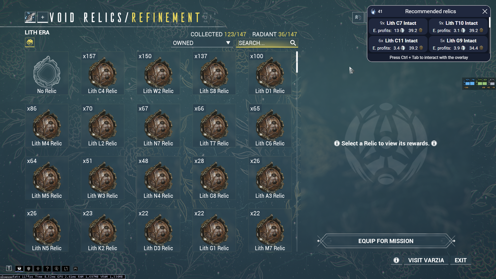

# Warframe Relic Picker

This project aims to simplify the process of selecting and equipping recommended relics from [AlecaFrame](https://www.alecaframe.com) overlay during selection of Void Relic for Void Fissures missions in Warframe.

## How to Use

1. **Download and Install AlecaFrame**: Begin by downloading and installing [AlecaFrame](https://www.alecaframe.com) on your system.

2. **Select a Void Fissures Mission**: Launch Warframe and select a Void Fissures mission.

3. **Wait for AlecaFrame's Recommended Relics**: Once in the "Void relic/Refinement" section, wait until AlecaFrame's recommended relics appear on the overlay.

4. **Pick Relics Using Hotkeys**: Press the corresponding hotkeys to pick the relics you want to equip for the mission:


```
F1=Lith C7 Intact   F2=Lith T10 Intact
F3=Lith C11 Intact  F4=Lith G9 Intact
```

5. **Automated OCR Process**: The program will automatically use OCR (Optical Character Recognition) to identify the recommended relics from the overlay, search and select them for you.


## Download

[See releases page](https://github.com/Martk0s/wf-relic-picker/releases/latest)


## Run from source

### Requirements

- Python 3.8.x

### Installation

1. Clone the repository:

```bash
git clone https://github.com/yourusername/warframe-relic-picker.git
```

2. Install required Python packages:

```bash
pip install -r requirements.txt
```

### Running the Program

Run the Python script:

```bash
python main.py
```

## License

This project is licensed under the GNU GENERAL PUBLIC LICENSE Version 3 - see the [LICENSE](LICENSE) file for details.


## Disclaimer

This project is developed independently and is not affiliated with or endorsed by AlecaFrame or the Overwolf development team. While this program utilizes the AlecaFrame overlay, it is a separate and standalone project created by me for the purpose of enhancing the user experience in Warframe. Any issues or inquiries related to AlecaFrame or Overwolf should be directed to their respective developers and support teams.
